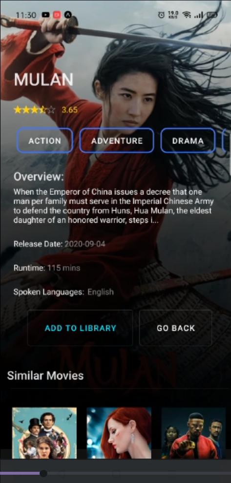
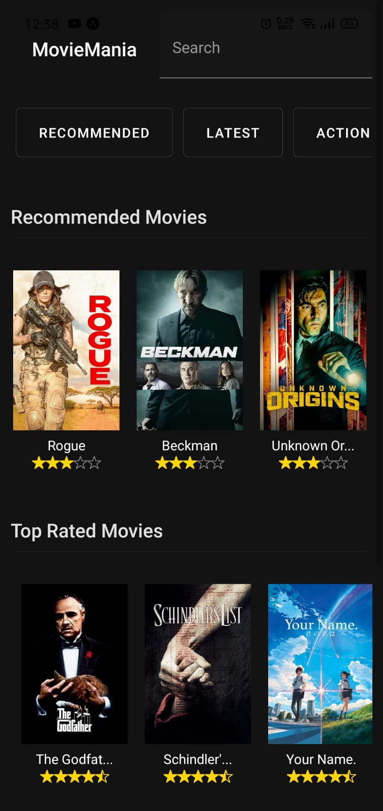
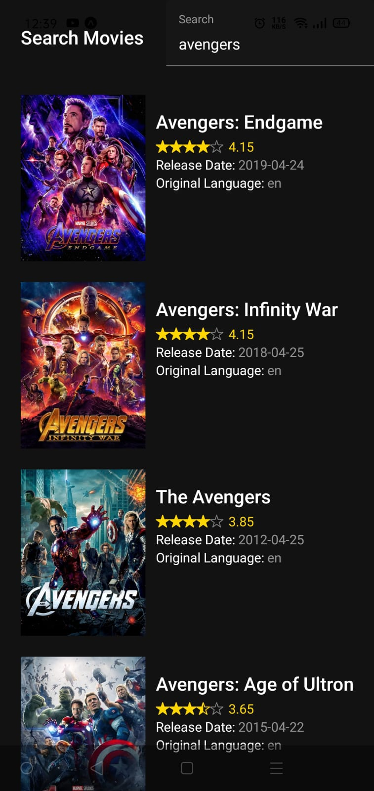

# MovieMania

Discover your favourite movies and track them using MovieMania.



# Technologies Used

- React Native
- Async Storage
- Axios
- Expo-cli
- React Native Reanimated
- React Navigation v5
- React Native Paper
- Material Design

# Run Instructions

## Before Run

- Create an api key in [themoviedb](http://themoviedb.org)

- In TMDB API config file, create the following pairs (key/value):
- api_key: YOUR_API_KEY

```bash
git clone https://github.com/Umernasirr/MovieMania-RN.git
cd MovieMania-RN && (npm i || yarn)
```

## To run the application

After navigating to the base directory

```bash
expo start
```

# Screenshots

### The Home and Detailed Description of movies shown.

<br/>


<br/>
<br/>

### Searching of Movies using category or keywords

<br/>



